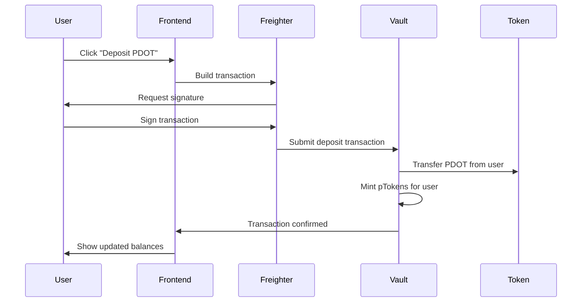

# 🌟 Peridot Soroban - Stellar DeFi Vault Dashboard

> **A complete DeFi vault system built on Stellar's Soroban smart contracts, where users can deposit PDOT tokens and receive pTokens (receipt tokens) in return.**

## 🎯 What is This Project?

Imagine you have some tokens and you want to put them in a "digital vault" for safekeeping or to earn rewards. That's exactly what this project does! 

**Peridot Soroban** is a decentralized finance (DeFi) application that demonstrates how to build a token vault system on the Stellar blockchain using Soroban smart contracts. Users deposit PDOT tokens into a vault and receive pTokens (receipt tokens) that represent their deposit. Later, they can exchange their pTokens back for the original PDOT tokens.

Think of it like a digital bank deposit slip - you give the bank your money, they give you a receipt, and you can later exchange that receipt for your money back.

## 🏗️ Architecture Overview

This project consists of three main components that work together:

```
┌─────────────────┐    ┌──────────────────┐    ┌─────────────────┐
│   Frontend      │    │  Smart Contracts │    │  Stellar        │
│   Dashboard     │◄──►│  (Soroban)       │◄──►│  Network        │
│   (Next.js)     │    │                  │    │  (Testnet)      │
└─────────────────┘    └──────────────────┘    └─────────────────┘
```

### 1. **Smart Contracts** (`/contracts/`)
- **Token Contract**: A standard Stellar token (PDOT) that users can mint and transfer
- **Receipt Vault Contract**: The main vault that accepts PDOT deposits and issues pTokens
- **Simple Vault Contract**: A basic vault implementation for comparison

### 2. **Frontend Dashboard** (`/peridot-dashboard/`)
- **Next.js Application**: Modern React-based web interface
- **Freighter Integration**: Connects to users' Stellar wallets
- **Real-time Balances**: Shows PDOT and pToken balances
- **Transaction Interface**: Deposit and withdraw functionality

### 3. **Stellar Network Integration**
- **Testnet Deployment**: All contracts deployed on Stellar Testnet
- **CLI Integration**: Uses Stellar CLI for contract interactions
- **Soroban RPC**: Direct communication with Soroban smart contracts

## 🚀 The Complete Journey: From Zero to DeFi Vault

### Step 1: Setting Up the Stellar Environment

First, we need to create our Stellar identity and set up the development environment:

```bash
# Install Stellar CLI
curl -sSL https://stellar.org/install.sh | bash

# Create a new identity (this becomes our "Alice" account)
stellar keys generate alice --network testnet

# Fund the account with test XLM (Stellar's native currency)
stellar keys fund alice --network testnet
```

**Why do we need this?** Every interaction on Stellar requires an account with XLM to pay for transaction fees. Alice becomes our "admin" account that can deploy contracts and mint tokens.

### Step 2: Creating the PDOT Token

Now we create our custom token that users will deposit:

```bash
# Deploy the token contract
stellar contract deploy \
  --wasm contracts/token/target/wasm32-unknown-unknown/release/soroban_token_contract.wasm \
  --source alice \
  --network testnet

# Initialize the token with Alice as admin
stellar contract invoke \
  --id <TOKEN_CONTRACT_ID> \
  --source alice \
  --network testnet \
  -- initialize \
  --admin <ALICE_ADDRESS> \
  --decimal 9 \
  --name "Peridot Token" \
  --symbol "PDOT"
```

**Why PDOT?** We needed a custom token to demonstrate the vault functionality. PDOT (Peridot Token) represents any asset that users might want to store in a vault - it could be a stablecoin, a reward token, or any other digital asset.

### Step 3: Building the Vault Contract

The vault contract is the heart of our system:

```rust
// Key functions in the vault contract:
pub fn deposit(env: Env, user: Address, amount: u128) {
    // 1. Verify user authorization
    user.require_auth();
    
    // 2. Transfer PDOT tokens from user to vault
    token_client.transfer(&user, &env.current_contract_address(), &amount);
    
    // 3. Mint pTokens for the user (1:1 ratio)
    // 4. Update vault statistics
}

pub fn withdraw(env: Env, user: Address, ptoken_amount: u128) {
    // 1. Verify user has enough pTokens
    // 2. Burn the pTokens
    // 3. Transfer PDOT tokens back to user
}
```

**Why this design?** The vault acts as a custodian - it holds the real tokens and issues receipts (pTokens). This pattern is fundamental in DeFi and enables features like yield farming, lending, and more complex financial products.

### Step 4: Deploying and Connecting Everything

```bash
# Deploy the vault contract
stellar contract deploy \
  --wasm contracts/receipt-vault/target/wasm32-unknown-unknown/release/receipt_vault.wasm \
  --source alice \
  --network testnet

# Initialize the vault with our PDOT token
stellar contract invoke \
  --id <VAULT_CONTRACT_ID> \
  --source alice \
  --network testnet \
  -- initialize \
  --token_address <TOKEN_CONTRACT_ID>
```

### Step 5: Setting Up the Frontend

The dashboard connects all the pieces together:

```bash
cd peridot-dashboard

# Install dependencies
npm install

# Configure environment variables
echo "NEXT_PUBLIC_TOKEN_CONTRACT=<TOKEN_CONTRACT_ID>" >> .env.local
echo "NEXT_PUBLIC_VAULT_CONTRACT=<VAULT_CONTRACT_ID>" >> .env.local
echo "NEXT_PUBLIC_ALICE_ADDRESS=<ALICE_ADDRESS>" >> .env.local

# Start the development server
npm run dev
```

## 🔗 How It All Connects

### The Token Flow

1. **Minting PDOT**: Alice (admin) mints PDOT tokens and can transfer them to users
2. **User Deposits**: Users connect their Freighter wallet and deposit PDOT into the vault
3. **Receipt Tokens**: Vault issues pTokens as proof of deposit
4. **Withdrawals**: Users can exchange pTokens back for PDOT tokens anytime

### The Technical Flow



## 🛠️ Key Technologies Used

- **Soroban**: Stellar's smart contract platform (Rust-based)
- **Next.js**: Modern React framework for the frontend
- **Freighter**: Stellar wallet browser extension
- **Stellar SDK**: JavaScript library for Stellar interactions
- **TypeScript**: Type-safe JavaScript for better development

## 🎮 How to Use the Application

1. **Install Freighter**: Add the Freighter wallet extension to your browser
2. **Get Test Tokens**: Ask Alice to mint and transfer PDOT tokens to your address
3. **Connect Wallet**: Click "Connect Wallet" in the dashboard
4. **Deposit Tokens**: Enter amount and click "Deposit PDOT Tokens"
5. **Sign Transaction**: Approve the transaction in Freighter
6. **View pTokens**: See your pToken balance update
7. **Withdraw**: Use pTokens to withdraw original PDOT tokens

## 🔍 Understanding the Smart Contracts

### Token Contract Features
- **Standard Stellar Token**: Implements the Stellar token interface
- **Mintable**: Alice can create new tokens
- **Transferable**: Users can send tokens to each other
- **9 Decimal Precision**: Allows for fractional token amounts

### Vault Contract Features
- **Deposit Function**: Accepts PDOT, issues pTokens
- **Withdraw Function**: Burns pTokens, returns PDOT
- **Balance Tracking**: Keeps track of all user deposits
- **1:1 Exchange Rate**: Simple ratio for this demo (can be made dynamic)

## 🌐 Network Configuration

All contracts are deployed on **Stellar Testnet**:

- **Network**: `Test SDF Network ; September 2015`
- **Horizon URL**: `https://horizon-testnet.stellar.org`
- **Soroban RPC**: `https://soroban-testnet.stellar.org`

## 🚨 Important Notes

- **Testnet Only**: This is for demonstration purposes only
- **Educational Project**: Not audited for production use
- **Freighter Required**: Users need the Freighter wallet extension
- **Test XLM Needed**: Users need test XLM for transaction fees

## 🎯 What Makes This Special?

1. **Real Smart Contracts**: Uses actual Soroban contracts, not simulations
2. **Full Integration**: Complete frontend-to-blockchain integration
3. **Modern Stack**: Uses latest Stellar and web technologies
4. **Educational Value**: Clear, well-documented code for learning
5. **Extensible Design**: Easy to add features like yield farming, governance, etc.

## 🔮 Future Possibilities

This foundation can be extended to build:
- **Yield Farming**: Earn rewards for depositing tokens
- **Lending Protocols**: Borrow against deposited collateral
- **Governance Systems**: Vote on protocol changes with pTokens
- **Cross-Chain Bridges**: Connect to other blockchain networks
- **Advanced Trading**: Automated market makers and DEX integration

## 🤝 Contributing

This project demonstrates the power of Stellar's Soroban platform for building DeFi applications. Feel free to:
- Experiment with the code
- Add new features
- Deploy your own versions
- Build upon this foundation

---

**Ready to explore the future of decentralized finance on Stellar? Let's build something amazing together! 🚀** 