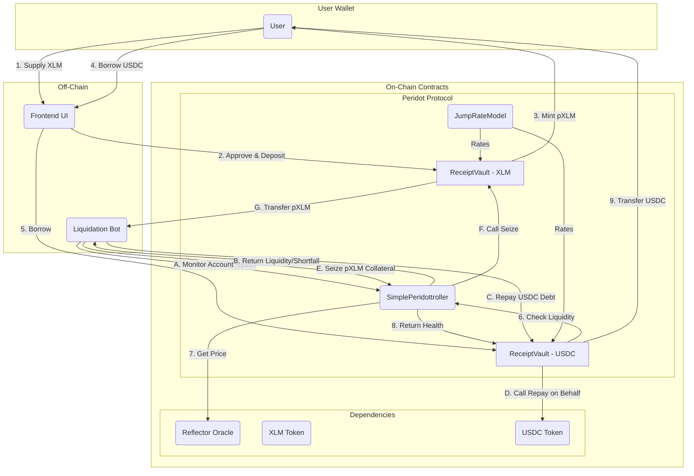

# Peridot Protocol STRIDE Threat Model

This document outlines the threat model for the Peridot lending protocol on Soroban, following the Stellar Development Foundation's recommended STRIDE methodology.

## 1. What are we working on?

Peridot is a decentralized lending protocol inspired by Compound V2, built on the Soroban smart contract platform. It allows users to supply assets to earn interest and borrow other assets against their supplied collateral.

The system consists of three core smart contracts:

1.  **`SimplePeridottroller` (Controller)**: The central risk management contract. It maintains a list of supported markets, manages collateral factors, integrates with an oracle for asset pricing, and orchestrates liquidations.
2.  **`ReceiptVault` (pToken/Market)**: A contract deployed for each lendable asset. It holds all supplied assets, issues pTokens to suppliers, and manages all `deposit`, `withdraw`, `borrow`, and `repay` logic.
3.  **`JumpRateModel`**: A modular contract that calculates dynamic supply and borrow interest rates based on market utilization.

### Data Flow Diagram

The following diagram illustrates the primary user interactions and data flows within the Peridot protocol.

### Trust Boundaries

- **User -> Frontend**: The user trusts the frontend UI to construct valid transactions, but all critical actions require the user's signature.
- **Frontend -> Contracts**: The contracts do not trust the frontend. All inputs are validated on-chain, and all state-changing actions are authorized via `require_auth()`.
- **Contracts -> Oracle**: The Controller trusts the Reflector Oracle to provide accurate and timely price data. A trust boundary exists here, mitigated by on-chain staleness checks.
- **Liquidation Bot -> Contracts**: The bot is an untrusted external entity. It can call public `liquidate` functions but cannot take any privileged actions. The protocol's security does not depend on the bot's honest operation.

## 2. What can go wrong?

### Threat Table

| Mnemonic Threat            | Issue ID     | Description                                                                                                                                                                                                                                                           |
| -------------------------- | ------------ | --------------------------------------------------------------------------------------------------------------------------------------------------------------------------------------------------------------------------------------------------------------------- |
| **S**poofing               | **Spoof.1**  | An attacker could call `deposit`, `borrow`, `repay`, etc., on behalf of another user if authorization is not correctly enforced.                                                                                                                                      |
| **T**ampering              | **Tamper.1** | An attacker could pass malicious or unexpected inputs to functions, such as an extremely large `amount` to `borrow`, a `market` address that is not a valid ReceiptVault, or a stale price from the oracle.                                                           |
| **R**epudiation            | **Repud.1**  | Given that all state-changing actions are signed transactions on the Stellar network, repudiation is not a significant threat. Every transaction is publicly verifiable on-ledger.                                                                                    |
| **I**nformation Disclosure | **Info.1**   | All contract state, including user balances, loan positions, and global market data, is public on the ledger. This is an inherent property of public blockchains and is expected behavior for a DeFi protocol. No sensitive off-chain data is stored.                 |
| **D**enial of Service      | **DoS.1**    | An attacker could attempt to block liquidations or other critical functions by creating conditions that cause a transaction to panic or exceed its resource budget (e.g., by entering an extremely large number of markets to make liquidity calculations expensive). |
| **E**levation of Privilege | **Elev.1**   | An attacker could attempt to call admin-only functions like `set_oracle`, `add_market`, or `set_collateral_factor` to manipulate protocol parameters for their benefit.                                                                                               |
| **E**levation of Privilege | **Elev.2**   | A malicious user could attempt to become the admin of the `JumpRateModel` contract by front-running the legitimate `initialize` call.                                                                                                                                 |

## 3. What are we going to do about it?

| Mnemonic Threat            | Remediation Steps                                                                                                                                                                                                                                                                                                                                                                                                                                                                                                                                                                                                                                                                                                     |
| -------------------------- | --------------------------------------------------------------------------------------------------------------------------------------------------------------------------------------------------------------------------------------------------------------------------------------------------------------------------------------------------------------------------------------------------------------------------------------------------------------------------------------------------------------------------------------------------------------------------------------------------------------------------------------------------------------------------------------------------------------------- |
| **S**poofing               | **Spoof.1.R.1**: All user-initiated actions (`deposit`, `borrow`, `repay`, `withdraw`, `enter_market`, `exit_market`) enforce `user.require_auth()`. This ensures that the transaction was signed by the user whose state is being modified. Liquidation is initiated by an external liquidator, who must also authorize the top-level call.                                                                                                                                                                                                                                                                                                                                                                          |
| **T**ampering              | **Tamper.1.R.1**: Input validation is performed throughout the contracts. The `borrow` and `withdraw` functions check the user's account health via `account_liquidity` to prevent withdrawing collateral needed to back loans. The controller maintains a whitelist of supported markets (`SupportedMarkets`), and all cross-market calculations iterate only over markets the user has explicitly entered.   **Tamper.1.R.2**: The `get_price_usd` function in the controller contains a staleness check (`pd.timestamp + max_age < now`). If an oracle price is older than a configurable threshold (`OracleMaxAgeMultiplier` \* `resolution`), it is rejected, preventing liquidations based on outdated data. |
| **R**epudiation            | **Repud.1.R.1**: No action is needed. The nature of the Stellar blockchain provides an immutable, publicly verifiable record of all transactions.                                                                                                                                                                                                                                                                                                                                                                                                                                                                                                                                                                     |
| **I**nformation Disclosure | **Info.1.R.1**: No action is needed. The protocol is designed to operate transparently on a public ledger.                                                                                                                                                                                                                                                                                                                                                                                                                                                                                                                                                                                                            |
| **D**enial of Service      | **DoS.1.R.1**: The number of markets a user can enter is limited by the Soroban transaction resource limits, which provides an implicit cap on the complexity of `account_liquidity` calculations. All loops are over user-entered markets, not a global market list, mitigating the risk of a single user's transaction affecting the entire protocol. Gas metering in Soroban prevents infinite loops or excessive computation from halting the network.                                                                                                                                                                                                                                                            |
| **E**levation of Privilege | **Elev.1.R.1**: All administrative functions in both `SimplePeridottroller` and `ReceiptVault` are protected by a `require_admin` check, which calls `admin.require_auth()`. Only the designated admin account can modify critical protocol parameters.   **Elev.2.R.1**: The `initialize` function in `JumpRateModel` was updated to set the `admin` to the contract invoker automatically. This change prevents a front-running attack where an unauthorized user could become the admin.                                                                                                                                                                                                                        |

## 4. Did we do a good job?

- **Has the data flow diagram been referenced since it was created?**

  - Yes. The diagram was essential for identifying the different actors (User, Liquidator, Admin) and the trust boundaries between them, which directly informed the STRIDE analysis.

- **Did the STRIDE model uncover any new design issues or concerns?**

  - Yes. The initial threat modeling exercise identified the potential for front-running the `initialize` function of the `JumpRateModel` contract. This was classified as an "Elevation of Privilege" threat (**Elev.2**) and was immediately remediated by updating the contract to set the admin to the invoker.

- **Did the treatments adequately address the issues identified?**

  - Yes. The combination of Soroban's built-in authorization (`require_auth`), explicit input validation, oracle staleness checks, and the fix for the initialization front-running provides a robust defense against the identified threats.

- **Have additional issues been found after the threat model?**
  - The threat model is a living document. No new architectural threats have been identified since this model was created, but it will be revisited as new features are added to the protocol.
